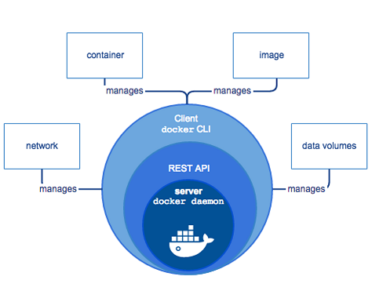
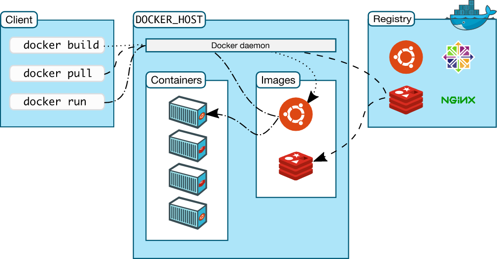

# Docker Introduction

Docker is Open Source Platform for developing and running application. It enables separate application from any specific infrastructure to deliver software fast.

# Docker Architecture

It is Client Server Architecture

# How Docker Works ?

# Install Docker

# Docker Version Check

`docker version`

# Docker Info Check

`docker info`

# Docker Status Check

`service docker status`

# Docker Start

`service start docker.service`
