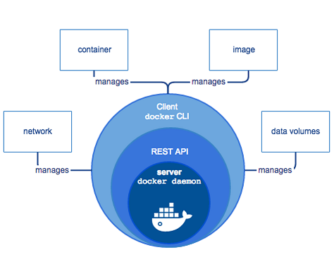
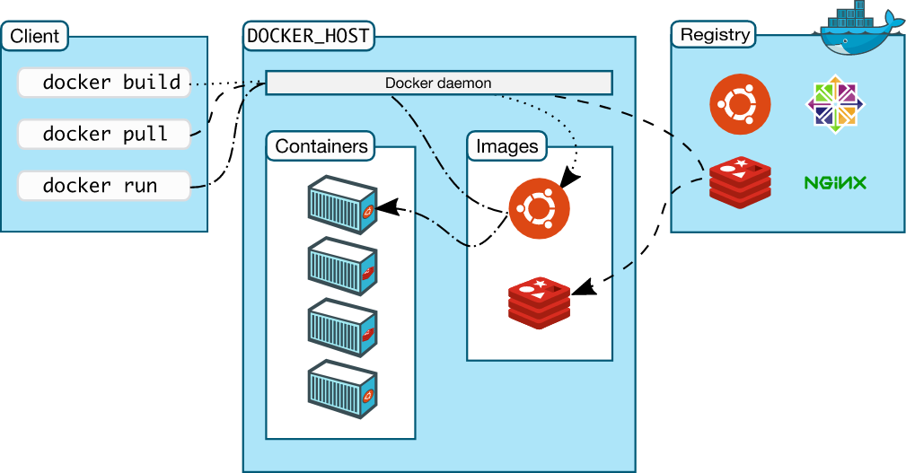

# Docker Introduction

Docker is Open Source Platform for developing and running application. It enables separate application from any specific infrastructure to deliver software fast.

# Docker Architecture

It is Client Server Architecture

# How Docker Works?

