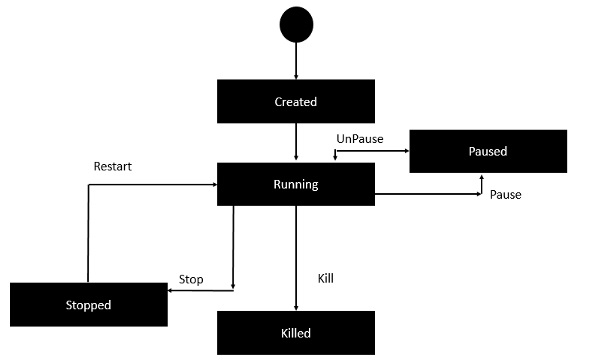

# Docker Containers

Container are running instance of images that can be run using the Docker run command.

## Container Lifecycle

# Commands

## List Container

Running Container Only :
`docker ps`
`docker container ls`
or
All Container :
`docker ps -a`
`docker container ls -a`

## Create/Run Container

`docker run image_name`
eg :`docker container run ubuntu`

### Some More Commands

`docker container run ubuntu sleep 30`
Here Sleep 30 is Command So that the container get sleep after 30 seconds

`docker container run ubuntu cat /etc/os-release`

`docker container run –it ubuntu /bin/bash`

### Docker History

`docker history image_id`
eg `docker history ubuntu`

### Docker Top

`docker history container_id`
eg `docker history 98af3`
