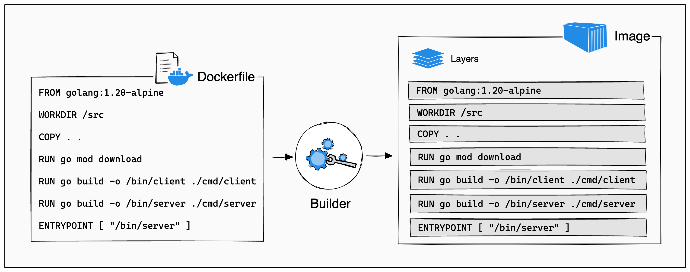

# Layered Architecture

Every Command or Instruction run on different Layer



# Dockerfile

A Dockerfile is a text document that contains all the commands a user could call on the command line to assemble an image.

## How to Write Docker Files

Format

```
# Comment
INSTRUCTION arguments
```

### 1: FROM

FROM in Dockerfile Instruction used to specify Docker Image Name and start the build process

```
FROM ubuntu:latest

FROM node:12

```

### 2: MAINTAINER

MAINTAINER in Dockerfile Instruction is used to about the person who creates the Docker Image

```
MAINTAINER support@fosstechnix.com
```

### 3: CMD

CMD in Dockerfile Instruction is used to execute a command in Running container, There should be one CMD in a Dockerfile.

CMD executes the commands when your Docker Image is deployed.

```
CMD ["/usr/sbin/apache2", "-D", "FOREGROUND"]
```

```
FROM ubuntu:latest
CMD /bin/bash
```

### 4: RUN

RUN in Dockerfile Instruction is used to execute any commands on top of current Docker Image

RUN executes the command when you are building Image.

```
# Comment
RUN echo 'we are running some # of cool things'
```

```
FROM ubuntu:latest
MAINTAINER support@fosstechnix.com
RUN apt-get update
RUN apt-get install -y apache2

#If you want to run .sh(shell script) file inside Dockerfile

COPY test.sh .
RUN ./test.sh
#OR
RUN /path/to/test.sh

```

### 5: LABEL

LABEL in Dockerfile Instruction is used to specify metadata information of Docker Image.

```
FROM ubuntu:latest
LABEL "author"="FOSS TechNIx"
LABEL "Date"="2020-09-29"
```

### 6: EXPOSE

EXPOSE in Dockerfile Instruction is used to specify Network port for Docker container

### To Expose port 80 of Docker container

`
EXPOSE 80

`

or

`
EXPOSE 8080/tcp

`

### 7: ENV

ENV in Dockerfile Instruction is used to set Environment Variables with key and value.

```
FROM node:12
ENV workdirectory /usr/node
```

### 8: ADD

ADD: Copies a file and directory from your host to Docker image, however can also fetch remote URLs, extract TAR/ZIP files, etc. It is used downloading remote resources, extracting TAR/ZIP files.

```
#Syntax:

ADD <source>... <destination>

#Example 1:

ADD java/jdk-8u231-linux-x64.tar /opt/jdk/
Example 2:

ADD https://fosstechnix.com/test.tar.xz /home/ubuntu/test/

```

### 9: COPY

COPY in Dockerfile Instruction used to Copies a file or directory from your host to Docker image, It is used to simply copying files or directories into the build context.

```
#Syntax:

COPY <source>... <destination>

#Example 1:
# To Install All dependencies for Node.js App

COPY package\*.json ./

RUN npm install

#To copy all application packages

COPY . .

#Example 2:

COPY index.html /var/www/html

```

### 10: ENTRYPOINT

ENTRYPOINT in Dockerfile Instruction is used you to configure a container that you can run as an executable.

ENTRYPOINT specifies a commands that will executes when the Docker container starts.

Example 1:

```
FROM ubuntu:latest

ENTRYPOINT ["ls"]
```

### 11: VOLUME

VOLUME in Dockerfile Instruction is used to create or mount volume to docker container.

Example 1:

```
FROM node:12
RUN mkdir /node
WORKDIR /node
RUN echo "Welcome to Node.js" > node
VOLUME /node
```

### 12: USER

USER in Dockerfile Instruction is used to set the user name and UID when running container

Example 1:

`USER admin`

To create new user in Dockerfile and login to user.

Example 2:

```
RUN adduser -D admin
USER admin
```

### 13: WORKDIR

WORKDIR in Dockerfile Instruction is used to set the working directory.

Example 1:

```
# To Create nodejsapp directory

WORKDIR /nodejsapp
```

### 14: ARG

ARG in Dockerfile Instruction is used to set Environment variables with key and value during the image build .

Example 1:

```
ARG JAVA_PATH=/opt/jdk/jdk1.8.0_251
ENV JAVA_HOME ${JAVA_PATH}
```

### 15: ONBUILD

ONBUILD in Dockerfile Instruction is used to specify command that runs when the image in Dockerfile is used as base image for another image.

Examples 1:

```
FROM node:12
RUN mkdir -p /usr/node/app
WORKDIR /usr/node/app
ONBUILD COPY package.json /usr/node/app/
ONBUILD RUN npm install
ONBUILD COPY . /usr/node/app
CMD [ "npm", "start" ]
```

### 16: STOPSIGNAL

STOPSIGNAL in Dockerfile Instruction is used to set the system call signal that will be sent to the container to exit

Example 1:

`STOPSIGNAL SIGQUIT`

### 17: SHELL

SHELL in Dockerfile Instruction is used to set the default shell.

`SHELL ["/bin/bash", "-c", "echo hello"]`

### 18: HEALTHCHECK

HEALTHCHECK in Dockerfile Instruction is used to Check container health by running a command inside the container

```
FROM ubuntu:latest
HEALTHCHECK --interval=60s --timeout=5s \
 CMD curl -f http://fosstechnix.info/ || exit 1
EXPOSE 80
```
