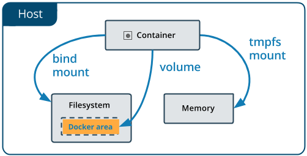

# Docker Volume

Volumes are the preferred mechanism for persisting data generated by and used by Docker containers. While bind mounts are dependent on the directory structure and OS of the host machine, volumes are completely managed by Docker. Volumes have several advantages over bind mounts:

Volumes are easier to back up or migrate than bind mounts.
You can manage volumes using Docker CLI commands or the Docker API.
Volumes work on both Linux and Windows containers.
Volumes can be more safely shared among multiple containers.
Volume drivers let you store volumes on remote hosts or cloud providers, to encrypt the contents of volumes, or to add other functionality.
New volumes can have their content pre-populated by a container.
Volumes on Docker Desktop have much higher performance than bind mounts from Mac and Windows hosts.
In addition, volumes are often a better choice than persisting data in a container's writable layer, because a volume doesn't increase the size of the containers using it, and the volume's contents exist outside the lifecycle of a given container.

### By Default Container data are not persisted

For Persistance we have some methods:
-docker volume
-bind mount
-tmpfs mount



Whenever you run container it created volume and the data is preset until container is not deleted. But volume created are not deleted. So if we want to use pervious volume we need to attach volume when running new container

# Docker Volume

## List Docker Volumes

`docker volume ls`

## Inspect Docker Volume

`docker volume inspect volume_id`

## Create Volume

`docker volume create --name any_name`

## Attach Volume with container running

```
docker container run -itd -v volume_name/volume_id:location image_name

#eg

docker container run -itd -v new_volume_name:/var/lib/mysql mysql

# above command create new volume
# or to use already created volume

docker container run -itd -v old_volume_name:/var/lib/mysql mysql

```

## Remove Volume

`docker volume rm volume_name1 volume_name2`

To Remove Used Volume We Need to stop container and delete container.

## Delete Unused Volume

`docker volume prune`

# Bind Mount

When you use a bind mount, a file or directory on the host machine is mounted into a container. The file or directory is referenced by its absolute path on the host machine.

`docker container run -it -v path_of_host_machine:path_of_container image_name bash`

`docker container run -it -v /home/user/folder:/tmp/folder ubuntu bash`

`docker container run -it -v $(pwd):/tmp/folder ubuntu bash`

for binding current folder

We Can bind with alternative way like below

`docker container run -it --mount type=bind,source:host_path,target:target_path ubuntu bash`

Note: if folder is not present it is created in container and We have to give full path of host machine otherwise volume will be created
