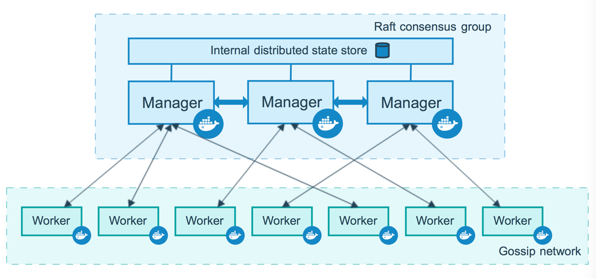
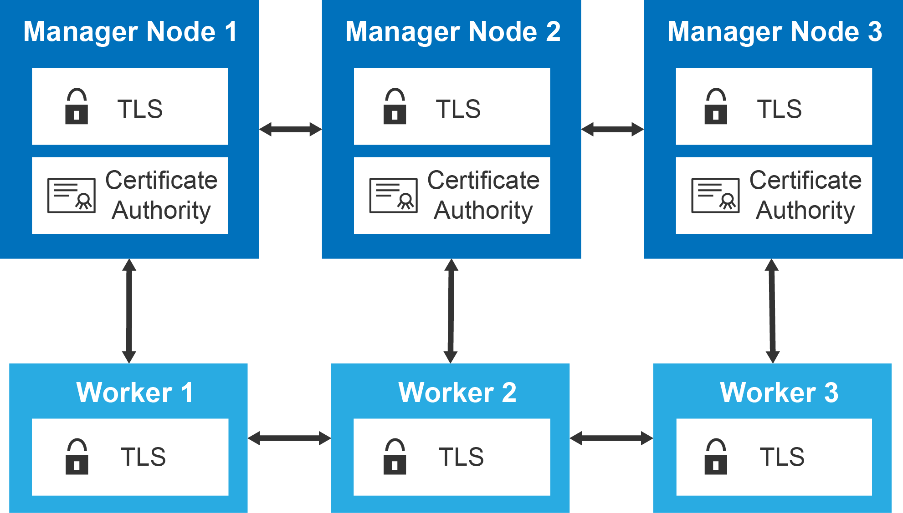

## Docker Swarm commands

These commands are used only in master node

Make Master Node: `docker swarm init`

Add Worker nodes: `docker swarm join --token token_generated_at_master_node  ip_of_master_node:port`

List All nodes : `docker node ls`

View Token: `docker swarm join-token worker/manager`

## Add and Remove Nodes

To Add/Join worker node : `docker swarm join-token worker`

This command gives the join command for worker with token. Nodes with generated token are added as worker node.

To Add/Join Manager node : `docker swarm join-token manager`

This command gives the join command for master with token. Nodes with generated token are added as manager node.

Remove Node from Cluster: `docker swarm leave`
Use This command to worker node which you want to leave
This will leave from its system but not from master system

To Remove Worker node from Master Node : `docker node rm -f workerId/workerHostname`

-f is for force

## Inspect node

`docker node inspect host_name |less`

## Promote and Demote Node

Promote : `docker node promote host_name1 host_name2`

Eg : `docker node promote worker01 worker02`

Demote : `docker node demote host_name1 host_name2`

Eg : `docker node demote worker01 worker02`

## Docker Service (create, ls , logs)

-- We can create service in master/manager node

create service : `docker service  create -d image_name any_command`

eg: `docker service create -d alpine ping ip_of_master_node`

list service : `docker service ls`

inspect service : `docker service inspect service_id | less`

`| less ` is for less data

logs of service : `docker service logs service_id`
