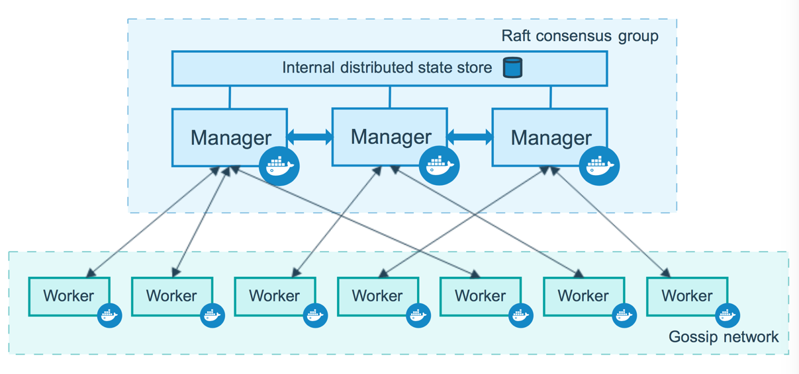
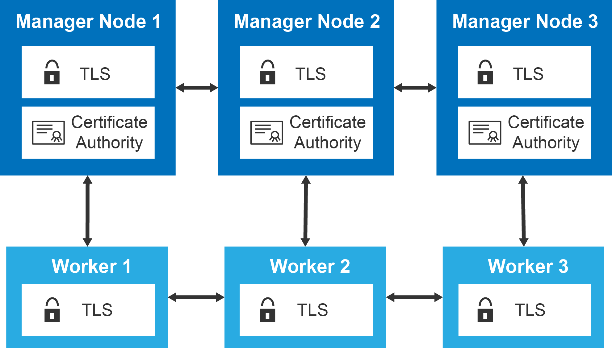

## Docker Swarm commands

These commands are used only in master node

Make Master Node: `docker swarm init`

Add Worker nodes: `docker swarm join --token token_generated_at_master_node  ip_of_master_node:port`

List All nodes : `docker node ls`

View Token: `docker swarm join-token worker/manager`

To Add/Join worker node : `docker swarm join-token worker`

This command gives the join command for worker with token. Nodes with generated token are added as worker node.

To Add/Join Manager node : `docker swarm join-token manager`

This command gives the join command for master with token. Nodes with generated token are added as manager node.

Remove Node from Cluster: `docker swarm leave`
Use This command to worker node which you want to leave
This will leave from its system but not from master system

To Remove Worker node from Master Node : `docker node rm -f workerId/workerHostname`

-f is for force
