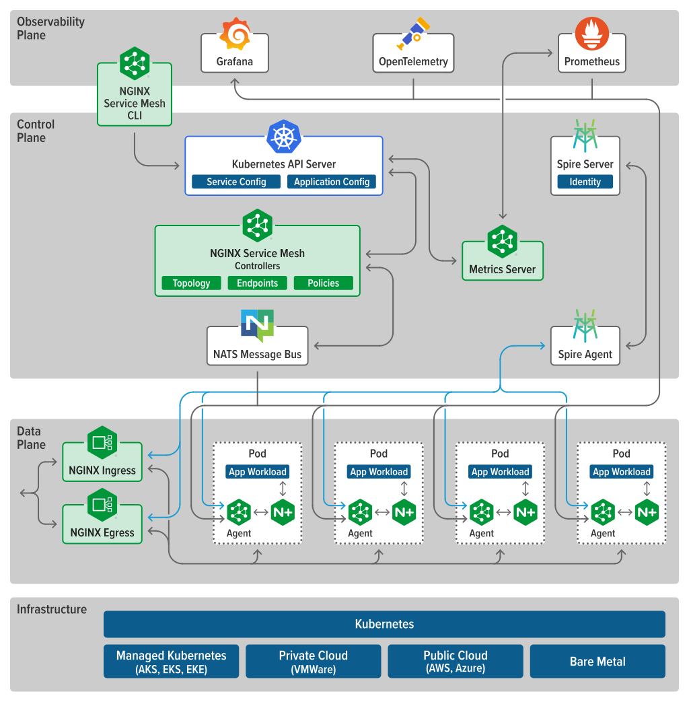

# NGINX

Keyword in nginx are called directives

Docs : https://nginx.org/en/docs/

- It is web server



Install on Ubuntu: `sudo apt-get install nginx`

Check Status: `sudo systemctl status nginx`

Entry Point of Nginx is nginx.conf

Nginx Have tree Structure

There are lot of blocks and the first block is main block

(first block or called context)

These below are the configuration of nginx.conf file

## main:

- number of worker process
- username
- PID
  We can configure these in main block

## main-->events:

- number of connection per worker process can handle

## main-->stream:

- TCP / UDP setting

## main--> HTTP:

- log locations for (log purpose)

It contains two blocks.
HTTP block can have multiple server blocks

## main-->HTTP-->server:

-virtual server

we can do setting of different websites here.
one server block can have multiple locations block

## main-->HTTP-->server-->location:

- used for routing (URI) eg: /api/product

## main-->HTTP-->upstream:

- used as reverse proxy

  It can be used to request to backend server and used as for load balancing


# Commands

validate nginx configuration: `sudo nginx -t`
View All nginx configuration: `sudo nginx -T`

reload nginx : `sudo systemctl reload nginx`

## For site host nginx on conf.d folder

```
#this is called virtual server and in apache it is called virtual host
#this keyword are called directives
#we can create multiple server blocks

server {
        # default_server can only be one for one machine
        listen 80 default_server;

        # this root directive contains the path of the project
        root /var/www/blog;

        # this server name contain the name of server
        server_name _;

        # here it contains the entry file with some combinations like .html or .htm or index
        index index.html index.htm;

        # this / is path it can be any route list /api or /login we can use regex by ~ or use = to exact match, and go to docs for this
        location / {
                #uri is the route after added to route directive
                # if uri not present return 404
                try_files $uri $uri/ = 404;

        }
}
```

## For Accessing website with username and password

## For site host nginx on conf.d folder

```
#this is called virtual server and in apache it is called virtual host
#this keyword are called directives
#we can create multiple server blocks

server {
        listen 80;

        root /var/www/blog;


        # url of the website
        # eg arjunsaud.com.np or www.arjunsaud.com.np or blog.arjunsaud.com.np
        server_name _;


        # This is build in for most of browser
        auth_basic "Any Message";
        auth_basic_user_file /etc/nginx/.htpasswd;

        # This .htpasswd can be generated by below command
        # cmd: sudo sh -c "echo -n 'username:' >> /etc/nginx/.htpasswd"
        # generate password cmd: sudo sh -c "openssl passwd -apr1 >> /etc/nginx/.htpasswd"

        index index.html index.htm;

        location / {
                # this turn off the auth at this route ("/")
                # This override the above auth
                auth_basic off;
                try_files $uri $uri/ = 404;
        }

        location /admin {
                try_files $uri $uri/=404;
        }
}
```

# Reverse Proxy

```

upstream backend{
        server localhost:3000;
}

server {
        listen 80;

        # use domain instead of localhost
        server_name localhost;

        location / {
                proxy_pass http://backend
        }
}

```
